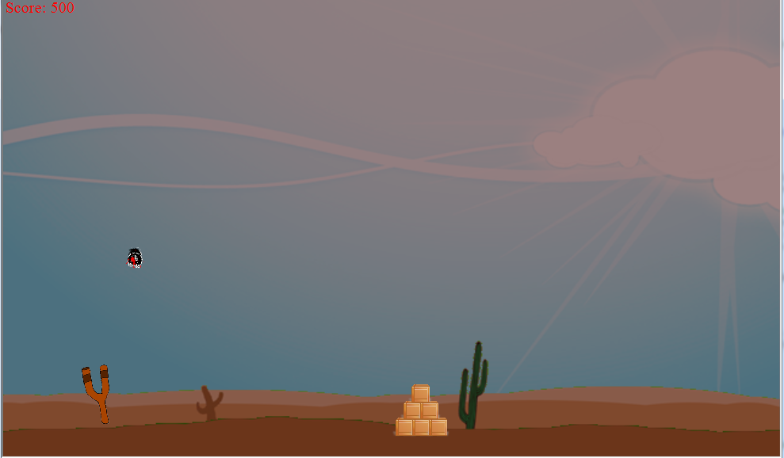
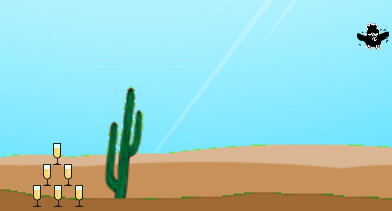
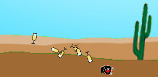
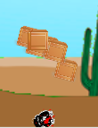
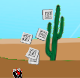

# Unhappy Flying Reptile
> It serves `shooting game on mouse to catch bird`.

### Used Technologies

C++, MFC, GDI+, Visual Studio  

## Description

It is the game to shoot a flying reptile on mouse. It uses chromakey to make background and simplified physics engine to implement dying reptile. The flying pattern is randomized by time. It change the directions and velocity by accelerator randomly. When reptile is shotted, it start dying motion with sound.

* Simplified physics engine.
	* When reptile is falling is accelerated toward ground and falling angle is changed by flying speed before dying.
	* When reptile hit the boxes, hitted boxes is throwing by reptile's falling speed and the side which reptile hit.
	* Boxes are connected when they hitted. For example, if the beside box hit another box, that box get more speed from hitting box.
	* Reptile and boxes are bounced on ground depending on falling speed.


## Screen Shot






## Installation

Windows:

```sh

```

## Usage example

## Development setup